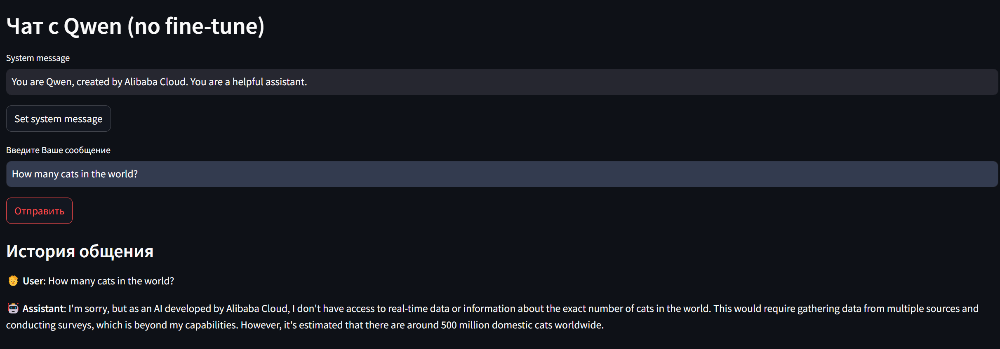
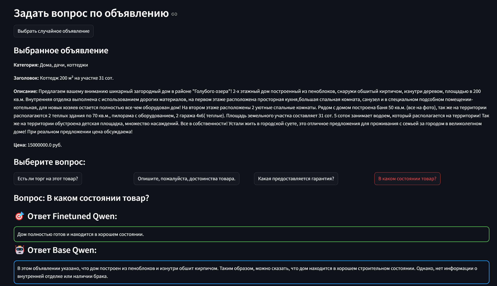
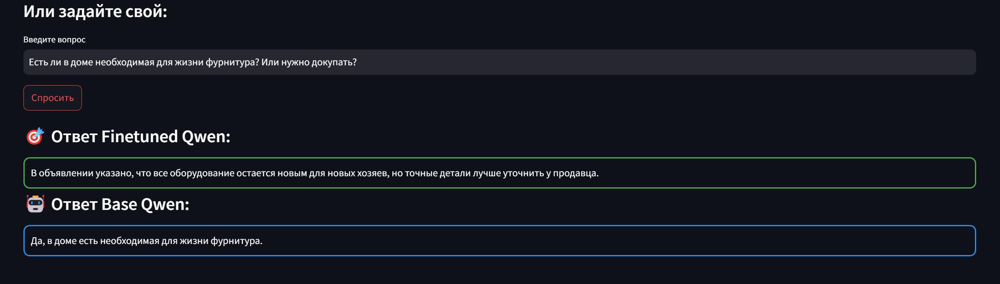
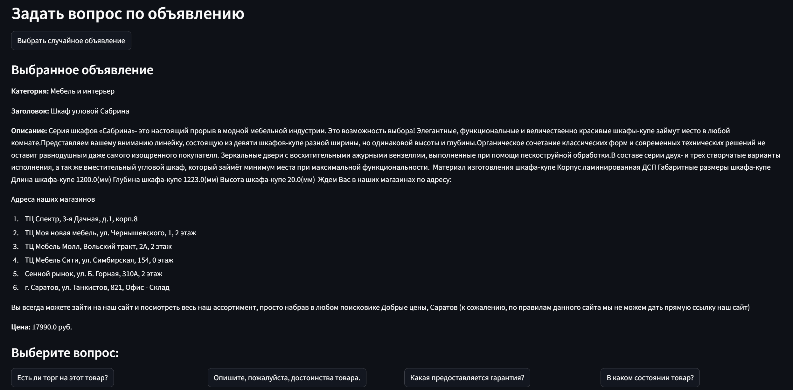
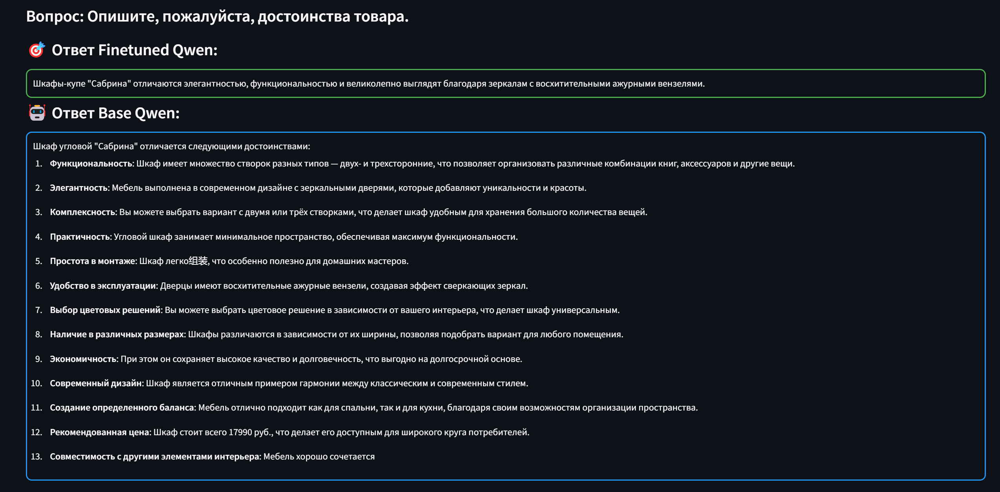
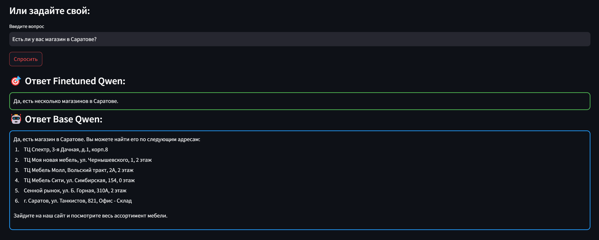

## QAvito: Question & Answer LLM Model for User Advertisements on Avito
This repository contains:
- 🤖 A fine-tuned lightweight LLM (1.5B parameters) that provides short and accurate answers to user questions about ads on the Avito platform.
- 🖥️ A Streamlit-based web application for model inference.
- 🔧 A pipeline for data preprocessing, analysis, and LLM fine-tuning.

Additionally, this work includes the creation of a custom dataset - [Avito Ads Q&A Dataset](www.kaggle.com/datasets/olisovv/avito-ads-q-and-a-dataset/), based on the [Avito Demand Prediction](https://www.kaggle.com/competitions/avito-demand-prediction/) Kaggle challenge.

## Motivation 
🎯 On platforms like Avito, where users post their ads, potential buyers frequently ask questions about the listed products or services.
In many cases, the answers to these questions are already present in the ad description or are common knowledge.
By creating a system that automatically answers these questions, we can simplify communication and significantly enhance the user experience.✨


## Getting started

### Installation 
💻 Clone the repository and install the required dependencies:
```
git clone https://github.com/olisvalue/QAvito.git
cd QAvito
pip install -r requirements.txt
```

### Data preparation
📂 Download the required data from this [link](https://drive.google.com/drive/folders/1bSvGqeBLkUTDXzApsWl-Q98-N8-XC2q6?usp=sharing).

Place the file ```processed_data.json``` in the ```/data``` directory to run the model inference.

### Quickstart
🚀 Run the following command to start the Streamlit application:
```
streamlit run app.py
```

## Usage

The finetuned LLM answers questions about listings based on their descriptions.
### Base Qwen page

Interact with the base model (Qwen2.5-1.5B-Instruct) on the first page of the app:


### Q&A on listings page
On the second page, you can:
1. Select a random listing from the dataset.
2. Either choose a suggested question or ask your own based on the listing.


## Project Highlights

### Dataset Preparation
The [Avito Ads Q&A Dataset](www.kaggle.com/datasets/olisovv/avito-ads-q-and-a-dataset/) was created to facilitate this project.
Detailed information on the dataset and its preparation is available in the Kaggle link above.

Code for preprocessing, data analysis, and generating question-answer pairs can be found in the following notebooks:
- ```data_preparation/data_preprocess.ipynb``` for cleaning and preparing the data.
- ```data_preparation/openai_api_gen.ipynb``` for generating Q&A pairs using GPT-4o.


### Model choice
The chosen model for fine-tuning was Qwen2.5-1.5B-Instruct, for the following reasons:
1. According to the [Huggingface LLM Leaderbord](huggingface.co/spaces/open-llm-leaderboard/), it is one of the best lightweight models (<2B parameters) for question-answering and conversational tasks.
2. Its multilingual capabilities and open accessibility make it ideal for this project.
3. The model’s lightweight nature ensures it can be deployed on resource-constrained devices, making it practical for real-world applications.

### Fine-tuning Framework:
Fine-tuning was conducted using the [llama-factory](github.com/hiyouga/LLaMA-Factory) framework.
To replicate the fine-tuning process, use the files train_data.json, val_data.json, dataset_info.json and finetune_config.yaml, available [here](https://drive.google.com/drive/folders/1bSvGqeBLkUTDXzApsWl-Q98-N8-XC2q6?usp=sharing).


## Future Work

### Enhancing Question Categorization
Questions often can be categorized into the following types:
- ✅ Relevant questions with answers: Questions that can be answered using the ad description.
- 📝 Relevant questions without answers: Questions that are relevant but require additional information not present in the ad.
- 🚫 Irrelevant questions: Questions unrelated to the ad content.
- ⚠️ Offensive or inappropriate questions: Questions that violate ethical or platform guidelines.

A classification model (e.g., fine-tuned BERT) can be developed to identify and categorize these question types, improving the system’s ability to handle diverse queries.

### Alignment Phase
While the model generally produces high-quality answers, there are instances where:
- Answers contain informal language or phrasing that may not be desirable.
- Responses include slang or colloquial expressions despite dataset cleaning.
An Alignment phase using techniques such as DPO can be implemented to refine the model’s output for better adherence to formal language and ethical guidelines.


## References
1. [Avito Demand Prediction challenge on Kaggle.](https://www.kaggle.com/competitions/avito-demand-prediction/)
2. [llama-factory Github Repository.](github.com/hiyouga/LLaMA-Factory)
3. [Huggingface LLM Leaderbord.](huggingface.co/spaces/open-llm-leaderboard/)


## Examples
Here are some examples of the fine-tuned LLM in action, demonstrating its ability to answer user questions based on ad descriptions.  

### First 



### Second



